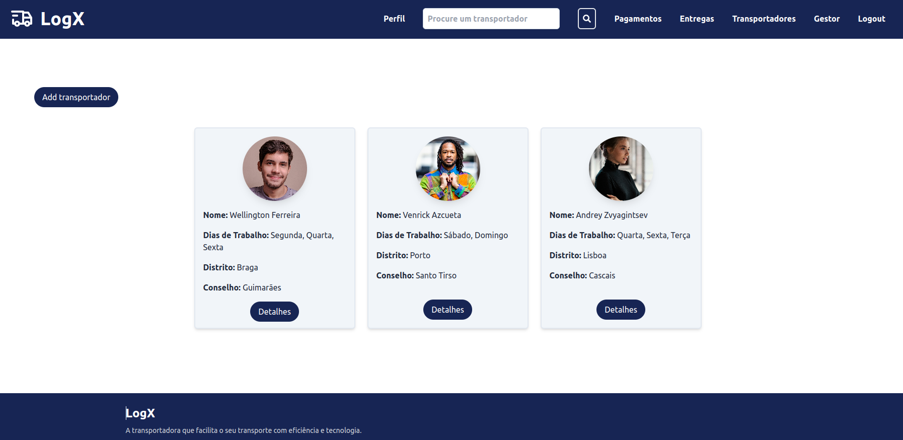
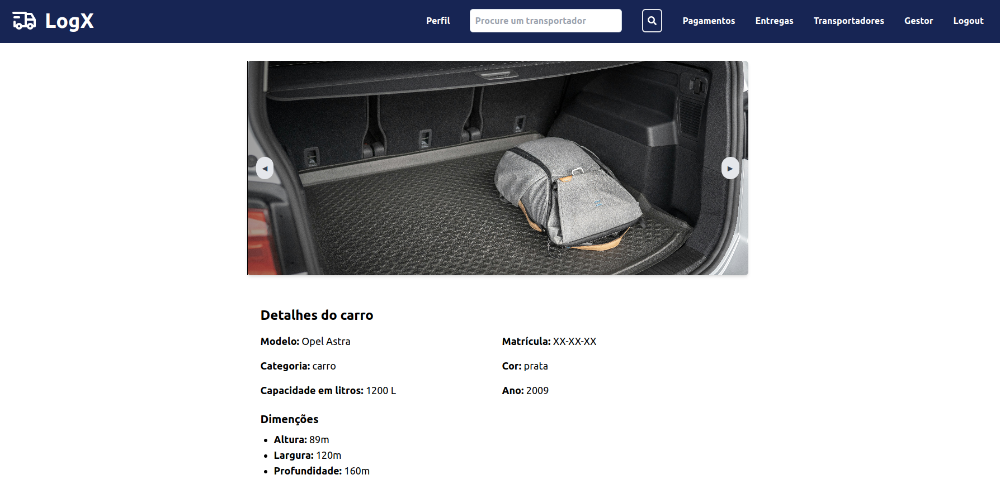

&nbsp;

<h1 align="center">📦 LogX</h1>

&nbsp;

## 📖 Description

A modern web project built using React and Vite, featuring TailwindCSS for styling. This application is structured to deliver fast performance and responsive design, making it ideal for modern web development.

## 💡 Features

- **Responsive UI**: Built with TailwindCSS for consistent styling.
- **Modular Architecture**: React components for scalability.
- **Integration with External API**: Retrieve and process data dynamically.

## 🔨 Tools

- **React**: Library for building UI.
- **Vite**: Fast build tool.
- **TailwindCSS**: Utility-first CSS framework.

## 🖥️ User interface

- The homepage introduces the application with a professional and user-friendly interface. It highlights the purpose of the platform and provides quick access to essential features. Users can find direct links to connect with manager users, ensuring seamless communication and collaboration.

  

The profile page allows users to see personal information, including name, email, and contact details.

  

- The transporters page displays a list of available transport providers, complete with relevant details. Users can filter and compare options to select the best fit for their needs, optimizing logistics management.

  

- The car page focuses on vehicle management, showcasing details about the registered cars, such as model, capacity, and status.

  

